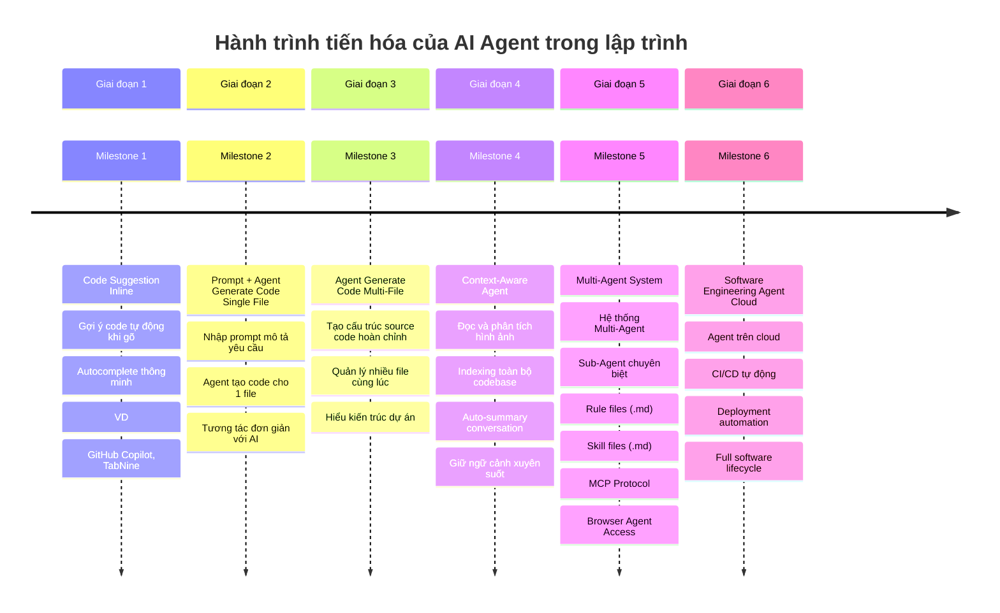
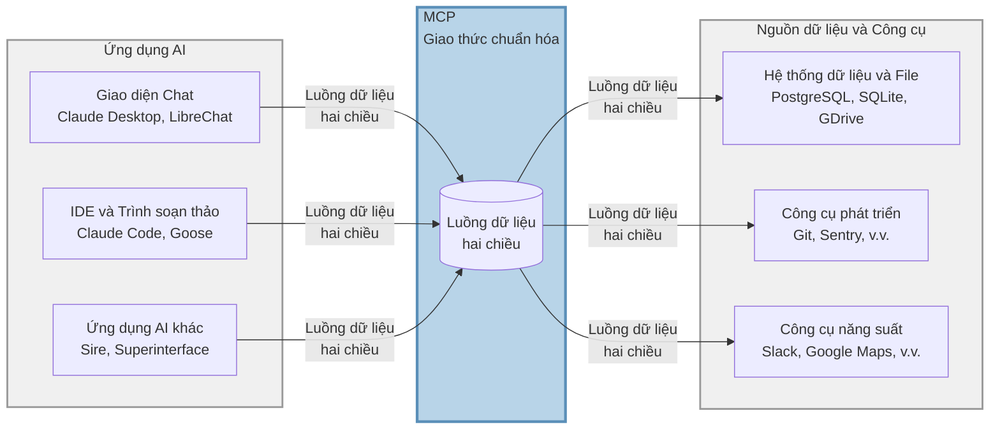

# Tổng quan

Đây là repository hướng dẫn tích hợp và ứng dụng MCP, Skill, Rule vào dự án để Human và Agent có thể phối hợp đạt được output gần với kỳ vọng nhất.

- **Lưu ý**: Đây không phải là project base code nextjs.
---

# Câu chuyện

Nếu bạn là người mới bắt đầu ứng dụng AI vào việc coding thì nên đọc qua chút, còn nếu bạn là người đã có kinh nghiệm sử dụng thì có thể bỏ qua phần bức tranh mà AI đang thay đổi cách chúng ta coding phát triển phần mềm.

## Quá trình phát triển AI Agent trong Coding



# Điều cần ghi nhớ
- Khi cài đặt các MCP, Skill... thì tôi khuyên bạn nên cài vào workspace phạm vi theo từng project, đừng cài vào global
- ✅ **Nên làm**: Cài đặt vào workspace của từng project (`.kiro/`, `.cursor/`, `.claude/`...) để dễ quản lý và tùy chỉnh theo nhu cầu riêng
- ❌ **Không nên làm**: Cài đặt global cho tất cả projects vì sẽ khó kiểm soát version và conflict giữa các dự án (/home/xxxxx/.cursor/mcp.json)


# Danh sách các phần

- RULE [Cursor](https://cursor.com/docs/context/rules) |  [Antigravity](https://antigravity.google/docs/rules-workflows) | [ClaudeCode](https://code.claude.com/docs/en/skills#extend-claude-with-skills)
- Command [Cursor](https://cursor.com/docs/context/commands) |  [Antigravity](https://antigravity.google/docs/command) | [ClaudeCode](https://code.claude.com/docs/en/skills#extend-claude-with-skills)
- [MCP](https://modelcontextprotocol.io/docs/getting-started/intro)
- [SKILL](https://skills.sh/)

**Thực sự thì mấy ông mẽo là chuyên gia trong việc phức tạp hóa mọi vấn đề lên**: rule, skill khác nhau ở đâu?

Mọi người cứ hiểu đơn giản, rule là những cái quy tắc mà Agent bắt buộc phải tuân thủ khi bước vào dự án, giống kiểu học sinh đến trường thì phải theo bộ rule mặc đồng phục, đi đúng giờ. Skill là những kiến thực chuyên biệt mà agent phải học để có thể vào dự án, giống kiểu học sinh đến trường thì sẽ được học các môn học riêng, toán, lý...

Ví dụ: 
- Rule: style code, structure folder, name convention 
- SKill: bộ kỹ năng, tip, trick rect best particle, next performance...
---

# MCP

## Khái niệm

MCP (Model Context Protocol) là giao thức chuẩn cho phép các AI Agent giao tiếp và tương tác với các nguồn dữ liệu, công cụ và dịch vụ bên ngoài một cách nhất quán. MCP cung cấp một lớp trừu tượng giúp Agent có thể truy cập thông tin và thực thi các tác vụ mà không cần phải tích hợp riêng lẻ từng dịch vụ. Hiểu đơn giản có nhiều nguồn data, đừng bắt Agent phải tạo 1 protocal riêng cho từng nguồn data.

Hãy hiểu đơn giản khi Agent muốn truy cập lấy data từ google docs, hay lấy data từ database mysql. Theo tư duy thông thường thì sử dụng API để agent request đến và nhận response. OMG sẽ ra sao nếu ta có hàng trăm service data cần tích hợp, vì thế cần đưa chúng về 1 cái chuẩn, 1 protocal duy nhất để giúp AGENT lấy được data của mọi nguồn mà không cần custom giao thức cho từng nguồn riêng lẻ. 



## Ứng dụng

- **Truy cập dữ liệu**: Kết nối với cơ sở dữ liệu, API, file system, figma, document framework

## Danh sách MCP Server được cài

- **MCP NextJS**: [next-devtools-mcp](https://github.com/vercel/next-devtools-mcp)
- **MCP Shadcn**: [shadcn@latest](https://ui.shadcn.com/docs/mcp)
- **MCP Figma Remote Server**: [fima remote server](https://developers.figma.com/docs/figma-mcp-server/remote-server-installation/)
  - cần bật figma mode dev, mất phí nhé mọi người

## Cách cài đặt trên từng Agent IDE

###  Claude Code CLI

1. Tạo file cấu hình tại `.mcp.json` (ở thư mục gốc của project)
2. Thêm cấu hình MCP server: [link](https://code.claude.com/docs/en/mcp)

```json
{
  "mcpServers": {
    "server-name": {
      "command": "uvx",
      "args": ["package-name@latest"],
      "env": {},
      "disabled": false,
      "autoApprove": []
    }
  }
}
```

3. Restart Claude Code để áp dụng thay đổi

###  Cursor IDE

1. Tạo file cấu hình tại `.cursor/mcp.json`
2. Thêm cấu hình tương tự như Claude Code [link](https://cursor.com/docs/context/mcp)
3. Restart Cursor để áp dụng thay đổi

###  Gemini Antigravity

1. Tạo file cấu hình tại `.gemini/antigravity/mcp_config.json`
2. Cấu hình theo format của Claude Code [link](https://antigravity.google/docs/mcp)
3. Reload extension để áp dụng

###  VS Code

1. Tạo file cấu hình tại `.vscode/mcp.json`
2. Cài đặt extension hỗ trợ MCP (nếu có) [link](https://code.visualstudio.com/docs/copilot/customization/mcp-servers)
3. Cấu hình server theo format chuẩn

###  Kiro IDE

1. Tạo file cấu hình tại `.kiro/settings/mcp.json`
2. Thêm cấu hình tương tự như Claude Code: [link](https://kiro.dev/docs/mcp/configuration/)
3. Khởi động lại Kiro hoặc reconnect MCP server từ MCP Server view

---

# SKILL

## Khái niệm

Skill là các kỹ năng hoặc kiến thức chuyên môn chuyên biệt được định nghĩa sẵn mà Agent có thể sử dụng để thực hiện các tác vụ cụ thể. Mỗi skill đại diện cho một kiến thức riêng biệt mà bạn muốn Agent học để nạp vào đầu nó.

## Ứng dụng

- **Tái sử dụng code**: Định nghĩa một lần, sử dụng nhiều lần
- **Chuẩn hóa quy trình**: Đảm bảo các tác vụ được thực hiện theo cách nhất quán
- **Tăng hiệu suất**: Agent có thể nhanh chóng áp dụng các pattern đã được tối ưu
- **Dễ dàng bảo trì**: Cập nhật skill ở một nơi, áp dụng cho toàn bộ dự án

## Skills CLI

Skills CLI (`npx skills`) là package manager cho hệ sinh thái agent skills. Bạn có thể tìm kiếm và cài đặt skills từ cộng đồng.

**Các lệnh chính:**

```bash
npx skills find [query]        # Tìm kiếm skills
npx skills add <package>       # Cài đặt skill
npx skills check               # Kiểm tra cập nhật
npx skills update              # Cập nhật tất cả skills
```

**Duyệt skills tại:** https://skills.sh/

## Cách cài đặt Skill trên từng Agent IDE

###  Windsurf IDE (Cascade)

**Thư mục:** `.windsurf/skills/` (workspace) hoặc `~/.codeium/windsurf/skills/` (global)

```bash
# Workspace skill (chỉ cho project hiện tại)
npx skills add <owner/repo@skill> --dir .windsurf/skills

# Global skill (cho tất cả projects)
npx skills add <owner/repo@skill> --dir ~/.codeium/windsurf/skills
```

Ví dụ:

```bash
npx skills add vercel-labs/skills@find-skills --dir .windsurf/skills
```

Cascade sẽ tự động nhận diện và invoke skills khi cần thiết.

**Lưu ý:** Windsurf cũng hỗ trợ tạo skill qua UI: Cascade panel → Menu (3 dots) → Skills → + Workspace/Global

###  Cline (VSCode Extension)

**Thư mục:** `.agents/skills/`

```bash
npx skills add <owner/repo@skill> --dir .agents/skills
```

Ví dụ:

```bash
npx skills add vercel-labs/skills@find-skills --dir .agents/skills
```

Restart VSCode hoặc reload Cline extension để áp dụng skill mới.

###  Claude Code CLI

**Thư mục:** `.claude/skills/`

```bash
npx skills add <owner/repo@skill> --dir .claude/skills
```

Ví dụ:

```bash
npx skills add vercel-labs/skills@find-skills --dir .claude/skills
```

Skill sẽ được tải tự động khi khởi động Claude Code.

###  Codex

**Thư mục:** `.codex/skills/`

```bash
npx skills add <owner/repo@skill> --dir .codex/skills
```

Ví dụ:

```bash
npx skills add vercel-labs/skills@find-skills --dir .codex/skills
```

Reload Codex để nhận diện skill mới.

###  Cursor IDE

**Thư mục:** `.cursor/skills/`

```bash
npx skills add <owner/repo@skill> --dir .cursor/skills
```

Ví dụ:

```bash
npx skills add vercel-labs/skills@find-skills --dir .cursor/skills
```

Restart Cursor để áp dụng thay đổi.

###  GitHub Copilot (VSCode)

**Thư mục:** `.github/skills/`

```bash
npx skills add <owner/repo@skill> --dir .github/skills
```

Ví dụ:

```bash
npx skills add vercel-labs/skills@find-skills --dir .github/skills
```

Skills sẽ được GitHub Copilot tự động nhận diện trong workspace.

###  Kiro IDE

**Thư mục:** `.kiro/skills/`

```bash
npx skills add <owner/repo@skill> --dir .kiro/skills
```

Ví dụ:

```bash
npx skills add vercel-labs/skills@find-skills --dir .kiro/skills
```

Skill sẽ tự động được tải khi Kiro khởi động.

### Cài đặt Global (cho tất cả projects)

Để cài đặt skill ở cấp độ user (áp dụng cho tất cả projects):

```bash
npx skills add <owner/repo@skill> -g -y
```

## Ví dụ cài đặt Skill

### Cài đặt skill tìm kiếm skills khác

```bash
# Windsurf IDE
npx skills add vercel-labs/skills@find-skills --dir .windsurf/skills

# Cline (VSCode)
npx skills add vercel-labs/skills@find-skills --dir .agents/skills

# Claude Code CLI
npx skills add vercel-labs/skills@find-skills --dir .claude/skills

# Codex
npx skills add vercel-labs/skills@find-skills --dir .codex/skills

# Cursor IDE
npx skills add vercel-labs/skills@find-skills --dir .cursor/skills

# GitHub Copilot (VSCode)
npx skills add vercel-labs/skills@find-skills --dir .github/skills

# Kiro IDE
npx skills add vercel-labs/skills@find-skills --dir .kiro/skills

# Global (cho tất cả projects)
npx skills add vercel-labs/skills@find-skills -g -y
```

### Cài đặt skill React best practices

```bash
# Windsurf IDE
npx skills add vercel-labs/agent-skills@vercel-react-best-practices --dir .windsurf/skills

# Cline (VSCode)
npx skills add vercel-labs/agent-skills@vercel-react-best-practices --dir .agents/skills

# Claude Code CLI
npx skills add vercel-labs/agent-skills@vercel-react-best-practices --dir .claude/skills

# Codex
npx skills add vercel-labs/agent-skills@vercel-react-best-practices --dir .codex/skills

# Cursor IDE
npx skills add vercel-labs/agent-skills@vercel-react-best-practices --dir .cursor/skills

# GitHub Copilot (VSCode)
npx skills add vercel-labs/agent-skills@vercel-react-best-practices --dir .github/skills

# Kiro IDE
npx skills add vercel-labs/agent-skills@vercel-react-best-practices --dir .kiro/skills
```

## Tạo Skill tùy chỉnh

1. Khởi tạo skill mới:

```bash
npx skills init my-custom-skill
```

2. Chỉnh sửa file `SKILL.md` trong thư mục skill
3. Định nghĩa rõ ràng:
   - `name`: Tên skill
   - `description`: Mô tả chức năng
   - Nội dung hướng dẫn sử dụng

## Sử dụng Skill

- Agent sẽ tự động nhận diện và sử dụng skills đã cài đặt
- Bạn có thể yêu cầu Agent sử dụng skill cụ thể trong prompt
- Kết hợp nhiều skills để tạo workflow phức tạp

---

## Đóng góp

Mọi đóng góp đều được chào đón! Vui lòng tạo Pull Request hoặc Issue để thảo luận về các cải tiến.

## License

MIT License
