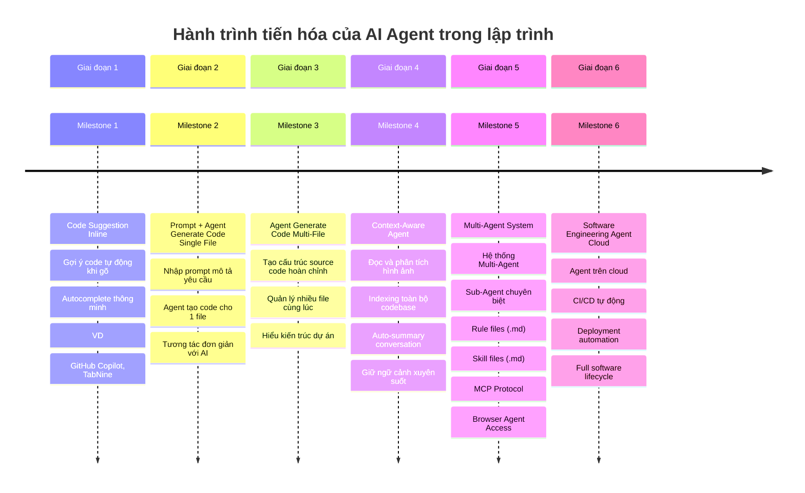
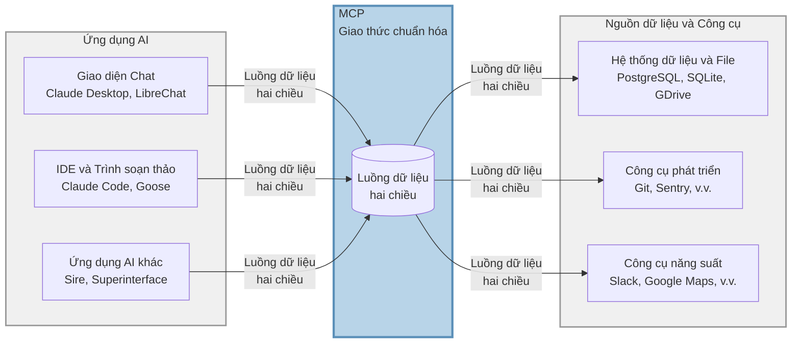

# Tổng quan

Đây là repository hướng dẫn tích hợp và ứng dụng MCP, Skill, Rule vào dự án để Human và Agent có thể phối hợp đạt được output gần với kỳ vọng nhất.

- **Lưu ý**: Đây không phải là project base code nextjs.
---

# Câu chuyện

Nếu bạn là người mới bắt đầu ứng dụng AI vào việc coding thì nên đọc qua chút, còn nếu bạn là người đã có kinh nghiệm sử dụng thì có thể bỏ qua phần bức tranh mà AI đang thay đổi cách chúng ta coding phát triển phần mềm.

## Quá trình phát triển AI Agent trong Coding



# Điều cần ghi nhớ
- Khi cài đặt các MCP, Skill... thì tôi khuyên bạn nên cài vào workspace phạm vi theo từng project, đừng cài vào global
- ✅ **Nên làm**: Cài đặt vào workspace của từng project (`.kiro/`, `.cursor/`, `.claude/`...) để dễ quản lý và tùy chỉnh theo nhu cầu riêng
- ❌ **Không nên làm**: Cài đặt global (filesystem) cho tất cả projects vì sẽ khó kiểm soát version và conflict giữa các dự án (/home/xxxxx/.cursor/mcp.json)


# Danh sách các phần

- RULE [Cursor](https://cursor.com/docs/context/rules) |  [Antigravity](https://antigravity.google/docs/rules-workflows) | [ClaudeCode](https://code.claude.com/docs/en/skills#extend-claude-with-skills)
- Command [Cursor](https://cursor.com/docs/context/commands) |  [Antigravity](https://antigravity.google/docs/command) | [ClaudeCode](https://code.claude.com/docs/en/skills#extend-claude-with-skills)
- [MCP](https://modelcontextprotocol.io/docs/getting-started/intro)
- [SKILL](https://agentskills.io/home)
- [README cho Agent](https://agents.md/) - Nếu Human cần file README.md để overview dự án, thì Agent cũng cần 1 cái tương tự và đó là file file AGENTS.md (dễ nhiên là nội dung 2 file này sẽ phải khác nhau,  1 cái cho HUMAN đọc 1 cái cho Machine đọc)

**Thực sự thì mấy ông mẽo là chuyên gia trong việc phức tạp hóa mọi vấn đề lên**: rule, skill khác nhau ở đâu?

Mọi người cứ hiểu đơn giản, rule là những cái quy tắc mà Agent bắt buộc phải tuân thủ khi bước vào dự án, giống kiểu học sinh đến trường thì phải theo bộ rule mặc đồng phục, đi đúng giờ. Skill là những kiến thực chuyên biệt mà agent phải học để có thể vào dự án, giống kiểu học sinh đến trường thì sẽ được học các môn học riêng, toán, lý...

Ví dụ: 
- Rule: style code, structure folder, name convention 
- SKill: bộ kỹ năng, tip, trick rect best particle, next performance...
---

# MCP

## Khái niệm

MCP (Model Context Protocol) là giao thức chuẩn cho phép các AI Agent giao tiếp và tương tác với các nguồn dữ liệu, công cụ và dịch vụ bên ngoài một cách nhất quán. MCP cung cấp một lớp trừu tượng giúp Agent có thể truy cập thông tin và thực thi các tác vụ mà không cần phải tích hợp riêng lẻ từng dịch vụ. Hiểu đơn giản có nhiều nguồn data, đừng bắt Agent phải tạo 1 protocal riêng cho từng nguồn data.

Hãy hiểu đơn giản khi Agent muốn truy cập lấy data từ google docs, hay lấy data từ database mysql. Theo tư duy thông thường thì sử dụng API để agent request đến và nhận response. OMG sẽ ra sao nếu ta có hàng trăm service data cần tích hợp, vì thế cần đưa chúng về 1 cái chuẩn, 1 protocal duy nhất để giúp AGENT lấy được data của mọi nguồn mà không cần custom giao thức cho từng nguồn riêng lẻ. 



## Ứng dụng

- **Truy cập dữ liệu**: Kết nối với cơ sở dữ liệu, API, file system, figma, document framework, ví dụ cho phép agent đọc figma để generate ra code...

## Danh sách MCP Server được cài

- **MCP NextJS**: [next-devtools-mcp](https://github.com/vercel/next-devtools-mcp)
- **MCP Shadcn**: [shadcn@latest](https://ui.shadcn.com/docs/mcp)
- **MCP Figma Remote Server**: [fima remote server](https://developers.figma.com/docs/figma-mcp-server/remote-server-installation/)
  - cần bật figma mode dev, mất phí nhé mọi người

## Cách cài đặt trên từng Agent IDE

###  Claude Code CLI

1. Tạo file cấu hình tại `.mcp.json` (ở thư mục gốc của project)
2. Thêm cấu hình MCP server: [link](https://code.claude.com/docs/en/mcp)

```json
{
  "mcpServers": {
    "server-name": {
      "command": "uvx",
      "args": ["package-name@latest"],
      "env": {},
      "disabled": false,
      "autoApprove": []
    }
  }
}
```

3. Restart Claude Code để áp dụng thay đổi

###  Cursor IDE

1. Tạo file cấu hình tại `.cursor/mcp.json`
2. Thêm cấu hình tương tự như Claude Code [link](https://cursor.com/docs/context/mcp)
3. Restart Cursor để áp dụng thay đổi

###  Gemini Antigravity

1. Tạo file cấu hình tại `.gemini/antigravity/mcp_config.json`
2. Cấu hình theo format của Claude Code [link](https://antigravity.google/docs/mcp)
3. Reload extension để áp dụng

###  VS Code

1. Tạo file cấu hình tại `.vscode/mcp.json`
2. Cài đặt extension hỗ trợ MCP (nếu có) [link](https://code.visualstudio.com/docs/copilot/customization/mcp-servers)
3. Cấu hình server theo format chuẩn

###  Kiro IDE

1. Tạo file cấu hình tại `.kiro/settings/mcp.json`
2. Thêm cấu hình tương tự như Claude Code: [link](https://kiro.dev/docs/mcp/configuration/)
3. Khởi động lại Kiro hoặc reconnect MCP server từ MCP Server view

---

# SKILL

## Khái niệm

[Skill](https://agentskills.io/home) là các kỹ năng hoặc kiến thức chuyên môn chuyên biệt được định nghĩa sẵn mà Agent có thể sử dụng để thực hiện các tác vụ cụ thể. Mỗi skill đại diện cho một kiến thức riêng biệt mà bạn muốn Agent học để nạp vào đầu nó. Hoặc nó cũng có thể là 1 workflow chuyên biệt đang được dùng trong dự án mà bạn muốn agent nạp vào đầu.

## Ứng dụng

- **Sự thật**: Với các model on top ở thời điểm hiện tại như claude Opus 4.5, Codex 5.2 thì cá nhân mình thấy mấy cái kiểu react-best-particle, nextjs performance...nó đều xử lý bá đạo rồi. Nhưng cái nó thiếu là những mẹo, tips, trick được đúc kết trong quá trình làm dự án do Human note lại, nó không thể biết những bài vở đó, vì đó là những bài vở mà có thể chỉ dự án của bạn mới có, chỉ dự án bạn mới gặp phải.


## Marketplace

- "Chợ": Giống như MCP thì Skill cũng có cái chợ riêng, mọi người có thể upload những bộ skill lên đấy, hiện tại có nhiều chợ nhưng mình recommand bạn sử dụng chợ của [Vercel Skill.sh](skill.sh) 

- 

## Cách một Skill hoạt động 

1. **Discovery (Phát hiện):** Khi khởi động, agent tải **name và  description** metadata của mỗi skill — đủ để biết nó có thể phù hợp khi nào.  
2. **Activation (Kích hoạt):** Khi một nhiệm vụ trùng với mô tả của skill, agent tải toàn bộ nội dung `SKILL.md` vào ngữ cảnh.  
3. **Execution (Thực thi):** Agent thực hiện theo hướng dẫn, có thể tải thêm các file tham chiếu hoặc chạy mã đi kèm khi cần.

Cách tiếp cận này giúp agent **nhanh, nhẹ**, nhưng vẫn có thể truy cập nhiều thông tin chi tiết **khi cần**. 

À format file không ràng buộc nhé, chỉ required name và description, còn nội dung ở dưới thì viết như nào cũng được.
[Specfication](https://agentskills.io/specification)

## Skills CLI

Skills CLI (`npx skills`) là package manager cho hệ sinh thái agent skills. Bạn có thể tìm kiếm và cài đặt skills từ cộng đồng.

**Các lệnh chính:**

```bash
npx skills find [query]        # Tìm kiếm skills
npx skills add <package>       # Cài đặt skill
npx skills check               # Kiểm tra cập nhật
npx skills update              # Cập nhật tất cả skills
```

**Duyệt skills tại:** https://skills.sh/

## Cách cài đặt Skill trên từng Agent IDE

**Lưu ý:** Ở thời điểm 05/02/2026 symlinked đang bị lỗi với Cursor IDE, Cursor không thể load được symlinked

###  Cursor IDE

**Thư mục:** `.cursor/skills/`

```bash
npx skills add <owner/repo@skill> --dir .cursor/skills
```

Ví dụ:

```bash
npx skills add vercel-labs/skills@find-skills --dir .cursor/skills
```

Restart Cursor để áp dụng thay đổi.

###  Claude Code CLI

**Thư mục:** `.claude/skills/`

```bash
npx skills add <owner/repo@skill> --dir .claude/skills
```

Ví dụ:

```bash
npx skills add vercel-labs/skills@find-skills --dir .claude/skills
```

Skill sẽ được tải tự động khi khởi động Claude Code.

###  Google Antigravity


**Thư mục:** `.agent/skills/`

```bash
npx skills add <owner/repo@skill> --dir .agent/skills
```

Ví dụ:

```bash
npx skills add vercel-labs/skills@find-skills --dir .agent/skills
```

Skill sẽ được tải tự động khi khởi động Claude Code.


###  Codex

**Thư mục:** `.codex/skills/`

```bash
npx skills add <owner/repo@skill> --dir .codex/skills
```

Ví dụ:

```bash
npx skills add vercel-labs/skills@find-skills --dir .codex/skills
```

Reload Codex để nhận diện skill mới.

###  GitHub Copilot (VSCode)

**Thư mục:** `.github/skills/`

```bash
npx skills add <owner/repo@skill> --dir .github/skills
```

Ví dụ:

```bash
npx skills add vercel-labs/skills@find-skills --dir .github/skills
```

Skills sẽ được GitHub Copilot tự động nhận diện trong workspace.

###  Kiro IDE

**Thư mục:** `.kiro/skills/`

```bash
npx skills add <owner/repo@skill> --dir .kiro/skills
```

Ví dụ:

```bash
npx skills add vercel-labs/skills@find-skills --dir .kiro/skills
```

Skill sẽ tự động được tải khi Kiro khởi động.

### Cài đặt Global (cho tất cả projects)

Để cài đặt skill ở cấp độ user (áp dụng cho tất cả projects):

```bash
npx skills add <owner/repo@skill> -g -y
```

### Danh sách skills được cài đặt

- [find-skills](https://skills.sh/vercel-labs/skills/find-skills)
- [vercel-react-best-practices](https://skills.sh/vercel-labs/agent-skills/vercel-react-best-practices)
- [next-best-practices](https://skills.sh/vercel-labs/next-skills/next-best-practices)
- [next-cache-components](https://skills.sh/vercel-labs/next-skills/next-cache-components)
- [react-hook-form-zod](https://skills.sh/jezweb/claude-skills/react-hook-form-zod)
- [web-design-guidelines](https://skills.sh/vercel-labs/agent-skills/web-design-guidelines)
- [vercel-composition-patterns](https://skills.sh/vercel-labs/agent-skills/vercel-composition-patterns)
- [agent-browser](https://skills.sh/vercel-labs/agent-browser/agent-browser)
- [shadcn-ui](https://skills.sh/giuseppe-trisciuoglio/developer-kit/shadcn-ui)
- [tailwind-design-system](https://skills.sh/wshobson/agents/tailwind-design-system)
- [seo-audit](https://skills.sh/coreyhaines31/marketingskills/seo-audit)
- [mermaid-diagrams](https://skills.sh/softaworks/agent-toolkit/mermaid-diagrams)
- [beautiful-mermaid](https://skills.sh/intellectronica/agent-skills/beautiful-mermaid)
- [audit-website](https://skills.sh/squirrelscan/skills/audit-website)
- [frontend-design](https://skills.sh/anthropics/skills/frontend-design)
- [react-useeffect](https://skills.sh/softaworks/agent-toolkit/react-useeffect)
- [implement-design](https://skills.sh/figma/mcp-server-guide/implement-design)
- [create-design-system-rules](https://skills.sh/figma/mcp-server-guide/create-design-system-rules)
- [create-design-system-rules](https://skills.sh/figma/mcp-server-guide/create-design-system-rules)
- [code-connect-components](https://skills.sh/figma/mcp-server-guide/code-connect-components)


## Tạo Skill tùy chỉnh

1. Khởi tạo skill mới:

```bash
npx skills init my-custom-skill
```

2. Chỉnh sửa file `SKILL.md` trong thư mục skill
3. Định nghĩa rõ ràng:
   - `name`: Tên skill
   - `description`: Mô tả chức năng
   - Nội dung hướng dẫn sử dụng

## Sử dụng Skill

- Agent sẽ tự động nhận diện và sử dụng skills đã cài đặt
- Bạn có thể yêu cầu Agent sử dụng skill cụ thể trong prompt

---

## Đóng góp

Mọi đóng góp đều được chào đón! Vui lòng tạo Pull Request hoặc Issue để thảo luận về các cải tiến.
1. Fork repository và tạo feature branch.
2. Cài đặt dependencies với `pnpm install`.
3. Chạy `pnpm dev` để phát triển local và `pnpm local-check` trước khi push.
4. Giữ `pnpm-lock.yaml` đồng bộ và commit cùng với các thay đổi của bạn.
5. Gửi PR mô tả các thay đổi của bạn.

```
# fork repo trên GitHub

git clone https://github.com/<your-username>/nextjs-skill-agent.git
cd nextjs-skill-agent

git checkout -b feature/my-change
# sửa code...
git add .
git commit -m "Add my change"
git push origin feature/my-change

```

### 🧭 Quy trình Git

Chúng tôi tuân theo quy trình trunk-based đơn giản:

1. **Tạo feature branch** từ `main` với tên mô tả rõ ràng, ví dụ: `feature/add-search` hoặc `fix/header-layout`.
2. **Commit thường xuyên** sử dụng chuẩn [Conventional Commits](https://www.conventionalcommits.org/en/v1.0.0/) (`feat:`, `fix:`, `docs:`, v.v.).
3. **Push branch của bạn** và mở pull request vào `main` sau khi các kiểm tra đã pass.
4. Yêu cầu review, giải quyết feedback kịp thời, và squash-merge sử dụng tiêu đề conventional commit.

### ✅ Hướng dẫn commit message

Husky chạy commit-msg hook để validate tiêu đề commit trước khi lưu. Dòng đầu tiên phải tuân theo định dạng Conventional
Commits:

```
type(scope?): mô tả ngắn gọn
```

- **Các type được phép:** `build`, `chore`, `ci`, `docs`, `feat`, `fix`, `perf`, `refactor`, `revert`, `style`, `test`
- **Subject:** tối đa 72 ký tự, viết ở thể mệnh lệnh, không có khoảng trắng đầu/cuối
- **Scope (tùy chọn):** các từ viết thường phân tách bằng `-`, `/`, hoặc `.`

Ví dụ về commit message hợp lệ:

```
feat(search): add fuzzy match for suggestions
fix: trim user input before submit
chore: update dependencies
```

Merge commits (`Merge ...`) và automatic reverts (`Revert "..."`) bỏ qua validation để tương thích với các thao tác trên
GitHub UI.

## License

MIT License
